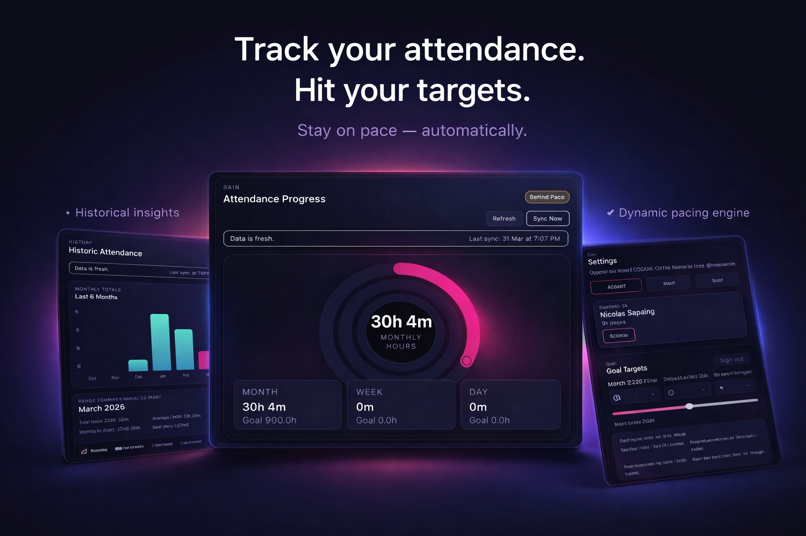

# TimeTracker42

A full-stack attendance tracking platform built around the 42 API.

Try out the website here: https://timetracker42.pages.dev/

I built this project to solve a real personal problem: tracking campus attendance against monthly visa requirements (90h/month) with clear pacing, goals, and deadline visibility.

## Preview



## Why This Project Exists

At 42, attendance data is the source of truth for progress and compliance. I wanted a production-minded system that:
- logs in securely with 42 OAuth
- syncs and preserves attendance history from the 42 API
- turns raw durations into meaningful KPIs and pace calculations
- works on iPhone and mobile web
- is architected to scale from one user to multiple users

## Key Features

- 🔐 Secure login via 42 OAuth (no credentials stored client-side)
- 📊 Activity-style rings for daily, weekly, and monthly progress
- 📅 Calendar visualization of attendance performance
- 🎯 Dynamic goal adjustment based on remaining time
- 🔄 Sync with 42 API + persistent storage
- 📉 Historical trends and monthly comparisons
- ⚠️ Stale data detection and sync indicators
- 📱 Mobile-first design (iOS app + PWA)

## Architecture

```text
[iOS SwiftUI App] ----\
                       -> [FastAPI Backend] -> [42 API]
[React Web App]  -----/          |
                                 v
                           [PostgreSQL]
```

## What I Built

### Backend (FastAPI + PostgreSQL)
- OAuth flow with 42 (start, callback, one-time mobile/web code exchange)
- JWT access + refresh session model
- Encrypted storage for provider OAuth tokens at rest
- Attendance sync pipeline from `/v2/users/:id/locations_stats`
- Persistent normalized attendance-by-day data model
- KPI endpoints for dashboard, history, goals, and deadlines
- Manual sync endpoint + scheduled hourly sync job
- Alembic migrations and test coverage

### iOS App (SwiftUI)
- Login flow integrated with backend OAuth exchange
- Dashboard with activity-style rings and KPI cards
- Attendance history screens and settings flows
- Goal and deadline management UI
- Keychain-based token persistence
- iPhone-only target configuration

### Web App (React + TypeScript + Vite + Tailwind)
- Mobile-first PWA-like experience (great on iPhone Safari)
- Three main app pages: Main, History, Settings
- Triple progress rings (day/week/month), calendars, monthly trends
- Goal + deadline management connected to backend APIs
- Session and networking hardening pass

## Security and Reliability Highlights

- 42 client secret stays on backend only
- OAuth state verification and redirect URI allowlisting
- One-time code exchange with replay protection
- Concurrency-safe attendance upsert strategy
- Production docs disabled outside local/test
- Endpoint rate limiting on auth + sync routes
- Runtime validation to reject placeholder secrets in non-local envs
- Stale data detection based on last successful sync

## Tech Stack

- Backend: FastAPI, SQLAlchemy, Alembic, PostgreSQL, httpx, jose
- iOS: SwiftUI, native URLSession, Keychain
- Web: React, TypeScript, Vite, Tailwind, React Query, Recharts
- Tooling: Pytest, Ruff, GitHub Actions CI, Xcode build

## Repository Structure

```text
backend/   FastAPI service, models, migrations, tests
ios/       SwiftUI app project and source
web/       React + TypeScript mobile-first frontend
docs/      runbook and architecture notes
```

## Local Setup

### 1) Backend

```bash
cd backend
cp .env.example .env
python3.12 -m venv .venv
source .venv/bin/activate
pip install -e '.[dev]'
```

Start PostgreSQL (local Docker):

```bash
docker compose up -d db
```

Run migrations and API:

```bash
alembic upgrade head
uvicorn app.main:app --reload
```

Health check:

```bash
curl http://127.0.0.1:8000/api/v1/health
```

### 2) Web App

```bash
cd web
cp .env.example .env
npm install
npm run dev
```

Default URL: `http://127.0.0.1:5173`

### 3) iOS App

Open:

```text
ios/CampusTracker.xcodeproj
```

Select an iPhone simulator/device and run `CampusTracker`.

## Required Environment Variables

Use `backend/.env.example` and `web/.env.example` as templates.

Critical backend values for non-local deployment:
- `APP_ENV` (set to `production`)
- `DATABASE_URL`
- `JWT_SECRET`
- `TOKEN_ENCRYPTION_KEY`
- `FORTYTWO_CLIENT_ID`
- `FORTYTWO_CLIENT_SECRET`
- `FORTYTWO_REDIRECT_URI`
- `WEB_OAUTH_REDIRECT_URIS`
- `WEB_ALLOWED_ORIGINS`

## Key API Surface

- `GET /api/v1/auth/42/start`
- `GET /api/v1/auth/42/callback`
- `POST /api/v1/auth/mobile/exchange`
- `POST /api/v1/auth/refresh`
- `POST /api/v1/auth/logout`
- `GET /api/v1/dashboard/summary`
- `GET /api/v1/attendance/history`
- `PUT /api/v1/goals/current`
- `GET/POST/PUT/DELETE /api/v1/deadlines`
- `POST /api/v1/sync/manual`

## Quality Gates

Backend tests:

```bash
cd backend
source .venv/bin/activate
pytest -q
```

Web checks:

```bash
cd web
npm run typecheck
npm run build
```

iOS build:

```bash
xcodebuild -project ios/CampusTracker.xcodeproj -scheme CampusTracker -destination 'platform=iOS Simulator,name=iPhone 17 Pro' build
```

## Current Status

This project is actively developed and already functional across backend, iOS, and web. Current focus is production deployment + public portfolio polish.
